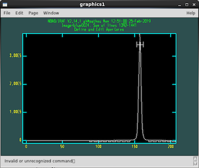
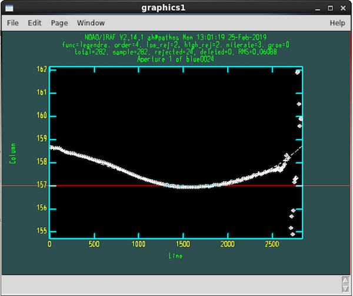
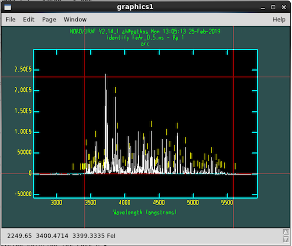
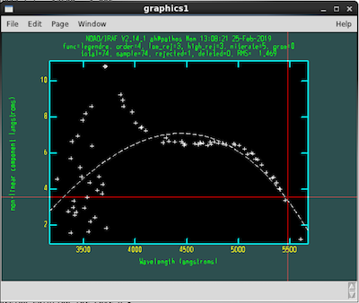

### Using the pipeline

This pipeline provides a thin wrapper around [pyraf](http://www.stsci.edu/institute/software_hardware/pyraf), which in turn is a thin wrapper around IRAF.  Accordingly, IRAF documentation for functions like `doslit`, `autoidentify`, `standard`, and `sensfunc` may be helpful to understand the command options. Search [here](http://stsdas.stsci.edu/gethelp/HelpSys.html) for IRAF function documentation.

You can obtain thorough help on any of the DBSP pipeline commands defined in this package with `help()`, e.g., `help(extract1D)`.

For help on IRAF commands, explore some of the following options:
Click graphics window, hit `?`
For window commands: click graphics window, type `w ?`.
For function documentation, type at the `ipython` prompt:

	iraf.help('doslit')
	iraf.dir('onedstds$')
	iraf.type('onedstds$README') (or iraf.page)
	iraf.epar('doslit')

`mark_bad()`:

All image files are uniquely identified by their `imgID` (an integer number) and the spectrograph arm (`side='red'` or `'blue'`), e.g., `red0018.fits`.  Most functions expect either a single `imgID` or a python list.

`create_arc_dome()`:

This command should operate automatically and generate several calibration products in the current directory.

After running, look at the flats (e.g, `flat_blue_1.0.fits`, `raw_flat_blue_1.0.fits`) in ds9 before continuing to make sure they don't have any weird features.  While rare, these issues are typically the result of science exposures being incorrectly detected as dome flats due to header keyword problems.

`store_standards()`:

This function extracts 1D spectra for the standard star exposures using `extract1D()`, so review the key commands below.

`extract1D()`:

This function is a convenience wrapper for IRAF's `doslit` and several other functions.  The pipeline loads a modified version of `doslit` to minimize unneeded interactivity.  

If you set `quicklook='yes'`, it will proceed without any intervention.  The default, `quicklook='no'`, prompts you to identify and fit the trace and fit the dispersion function.  This requires you to know which key commands the IRAF graphics window is expecting.  [This tutorial](http://www.twilightlandscapes.com/IRAFtutorial/IRAFintro_06.html) provides some guidance, and the discussion below identifies the most important.

When IRAF is waiting for your input in the graphics window, you can type `?` to get a list of the commands.  Some of these will begin with a colon, meaning that you can change a value by clicking on the gray bar in the bottom of the graphics window and typing something like `:function spline3`.  Typically once you are satified with a given selection you type `q` to accept and continue. 

Note that commands in the graphics window may require you to click to focus; then you may have to click back to type responses in the terminal.

The first screen (shown below) allows you to edit the aperture for extracting the spectrum.

* Use `d` to delete trace, `m` to set it
* `b` to enter background editing
* `z` to delete background intervals
* `s` `s` (with cursor positions) to mark new fit regions
* `f` to fit
* `q` to quit

After you have pressed 'q' to quit, you will be presented with an option to confirm;
the default is 'yes'. You can just press enter. You will have to click enter twice.

The second screen (shown below) allows you to fit the trace interactively using IRAF's `icfit`:

* `?` for help
* `:order #` to change fit order.  Default of 4 is probably fine; don't worry too much about excursions on the faint ends of the trace
* `d` to delete any points biasing the fit.  The flux is usually faint at the end, so if this does not
bias the fit too much don't bother deleting the points. 
* `s` (twice) to change the sampling region (e.g., to exclude faint ends)
* `f` to refit
* `q` to quit

Aim for RMS < 0.07 or so.  Note that points marked with diamonds are already ignored during the fit, as they are
automatically flagged as outliers. 

The next screen (see below) lets you fit the wavelength solution with IRAF's `autoidentify` and `reidentify`:

* `f` to fit/refit

Once you pressed `f`, here is what the screen should look like (blue side!)

The next step is to remove outlier points,
then add the full line list back in.

To improve the fit:

* `j` to switch to residuals plot
* `l` to go back to the previous view (after having pressed `j`)
* `d` to delete outliers (Note: blue side is often bad below 4000, delete those points)
* `f` ro re-fit (good values for the fit are <0.07 RMS)
* iterate between `d` and `f` until you are satisfied
* `q` to save solution.
* when you have the line view back, press `l` to add lines back in
* press `j` to view the new residuals plot (RMS will be slightly higher)
* if you are happy, press `q` to quit and save solution. 

If you have to (or want to) manually identify lines:

* `w x` to zoom in
* `m` to specify a line (with cursor hovering over it): enter the wavelength in angstroms
* `w a` to zoom out

do it for a second line (may already be identified)

* `f` to fit
* `d` to delete outliers
* `l` or `y` to ask for more lines
* `f` to fit again
* `q` twice to save solution

The process above (choose aperture, fit trace, fit/verify dispersion solution) occurs each time you run `extract1D()`.  If the extraction is part of the `store_standards()` call, you'll then continue with the following prompts:

The terminal will prompt: `change wavelength coordinate assignments?`
This is your chance to set wavelength range & binning: type `yes`.
Sensible defaults (assuming the 600/4000 grating on the blue side and 316/7500 grating on the red): 

	5500-10000, 1.525 red (new red camera)
	5500-7800, 2.47 red (old red camera)
	3400-5700, 1.07 blue (advanced: you can push to bluer wavelengths, for example 3200, if your target is particularly blue
	and if you know well how to deal with sensitivity function blowing up at the bluest end)
	
Accept the suggested number of output pixels, then say `no` when it asks you again if you want to change them.

You will be prompted back to the wavelength calibration window.  Once again, press `l` to add lines, `f` to
fit, `j` to see the residuals (and from here `l` to see the fit), `d` to remove outliers, and `f` to refit.  Press `q` twice to move on to the next
step. 

Next, you'll fit throughput functions for the standards; this uses IRAF's `standards`.	

* `?` for list or `iraf.page('onedstds$README')` 

all of the commonly-used ones are in `onedstds#iidscal`:
	
	g191b2b
	feige34
	bd332642
	bd284211
	
edit bandpasses	(choose smooth regions):

* `a` `a` (with mouse pointer at two positions) to place new bands
* `d` to delete bands (on absorption features, say)
* `q` to quit and save

You'll define bands for all of your standard exposures, then fit the sensitivity function with IRAF's `sensfunc`.

* `?` for help
* `s` over graphs to eliminate mean shifts due to non-photometric conditions (toggles)
* `d` to delete bad points

Make sure the fitted function doesn't go up after the last points--it will blow up the noise.  Also consider decreasing the order of the fit (`:order 4`) to avoid spline artifacts

After completing the above steps, the sensitivity function will be defined and you'll be ready to obtain science spectra using `extract1D()`.

`combine_sides()`:

This function combines data from the two spectrograph arms; it can also coadd data in an uncertainty-weighted manner.  The output filenames are taken from the `OBJECT` header keyword.

		
### Tips for on the fly reduction

Start reducing data after you have taken your first standard star exposure.

Copy (or `rsync`) new data into your `raw` subdirectory; then call `sync()` to 	bring the new files into your working directory without overwriting 	those you've already processed.

You can set `quicklook=yes` in `extract1D` to skip manual identification and fitting of the trace and dispersion.  Use with caution, particularly with faint sources.
